# Passed Pawn — documentation

**Passed Pawn** is an educational chess platform. **Coaches** build courses made of lessons
(tactical puzzles, quizzes, interactive board examples, videos), and **students** browse them,
get access, learn from them and leave reviews.

The project was created as a bachelor's thesis (University of Gdańsk, 2025).

## What's in this repo

| What | Where |
|---|---|
| Full documentation (thesis, in Polish): requirements, UI, architecture, DevOps, AI | [`passed_pawn_documentation_pl.pdf`](passed_pawn_documentation_pl.pdf) |
| English translation of the full documentation (unofficial, translated by Claude — the Polish version is the original) | [`passed_pawn_documentation_eng.pdf`](passed_pawn_documentation_eng.pdf) |
| Recordings of the main user flows (below) | [`videos/`](videos), watchable in the [video gallery](https://passed-pawn-dev.github.io/pp-documentation/) ([`index.html`](index.html)) |

## Source code

| Repository | Contents |
|---|---|
| [pp-frontend](https://github.com/passed-pawn-dev/pp-frontend) | SPA for coaches and students (Angular 19) |
| [pp-backend](https://github.com/passed-pawn-dev/pp-backend) | REST API and chess logic (.NET 8, PostgreSQL) |
| [pp-ai](https://github.com/passed-pawn-dev/pp-ai) | AI chat assistant: RAG over documents (FastAPI, LangChain, Chroma, Mistral) |
| [pp-keycloak](https://github.com/passed-pawn-dev/pp-keycloak) | Keycloak with a custom theme for the login and registration pages |
| [pp-dev-ops](https://github.com/passed-pawn-dev/pp-dev-ops) | Deployment: Helm charts for Kubernetes, Jenkins CI/CD pipelines, Keycloak configuration in Terraform |

## Demo videos

Short clips (30 s–2 min) recorded automatically with Playwright, with a visible cursor and
captions describing each step. Watch them in the **[video gallery](https://passed-pawn-dev.github.io/pp-documentation/)** (GitHub Pages) -
click a thumbnail or a title to open that video there. The MP4 files are in [`videos/`](videos).

### Coach — [`videos/coach/`](videos/coach)

| | Video | What it shows |
|---|---|---|
| <a href="https://passed-pawn-dev.github.io/pp-documentation/#e2e_coach">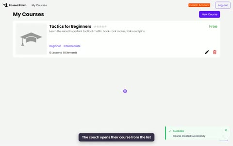</a> | **[Full coach flow](https://passed-pawn-dev.github.io/pp-documentation/#e2e_coach)** · 1:36 | Registration → login → new course → thumbnail → lessons |
| <a href="https://passed-pawn-dev.github.io/pp-documentation/#create_puzzle">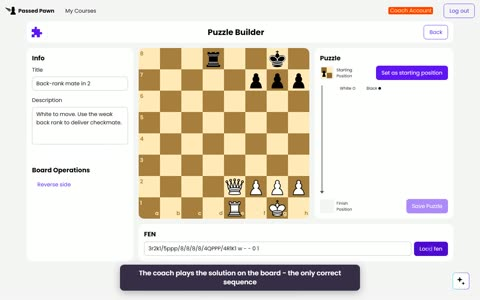</a> | **[Puzzle](https://passed-pawn-dev.github.io/pp-documentation/#create_puzzle)** · 0:45 | Creating a puzzle: position (FEN) + solution moves |
| <a href="https://passed-pawn-dev.github.io/pp-documentation/#create_quiz">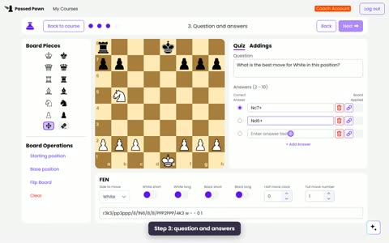</a> | **[Quiz](https://passed-pawn-dev.github.io/pp-documentation/#create_quiz)** · 0:55 | Board, question, answers, hint, explanation, preview |
| <a href="https://passed-pawn-dev.github.io/pp-documentation/#create_example">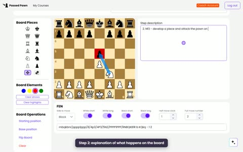</a> | **[Example](https://passed-pawn-dev.github.io/pp-documentation/#create_example)** · 1:27 | A 3-step example with arrows and highlighted squares |
| <a href="https://passed-pawn-dev.github.io/pp-documentation/#create_video">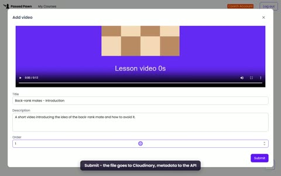</a> | **[Video](https://passed-pawn-dev.github.io/pp-documentation/#create_video)** · 0:42 | Uploading a lesson video |

### Student — [`videos/student/`](videos/student)

| | Video | What it shows |
|---|---|---|
| <a href="https://passed-pawn-dev.github.io/pp-documentation/#e2e_student">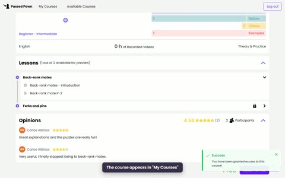</a> | **[Full student flow](https://passed-pawn-dev.github.io/pp-documentation/#e2e_student)** · 1:56 | Registration → course catalogue with filters → course details (coach, lessons, reviews) → free course → learning → review |
| <a href="https://passed-pawn-dev.github.io/pp-documentation/#use_puzzle">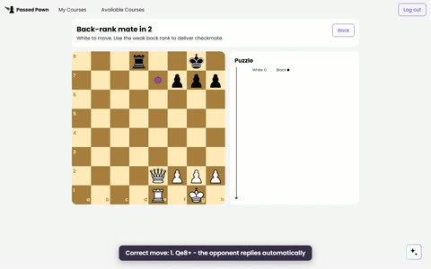</a> | **[Solving a puzzle](https://passed-pawn-dev.github.io/pp-documentation/#use_puzzle)** · 0:36 | A wrong move gets reverted, then the correct solution |
| <a href="https://passed-pawn-dev.github.io/pp-documentation/#use_quiz">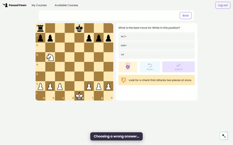</a> | **[Quiz](https://passed-pawn-dev.github.io/pp-documentation/#use_quiz)** · 0:35 | Hint, wrong answer, reset, correct answer |
| <a href="https://passed-pawn-dev.github.io/pp-documentation/#use_example">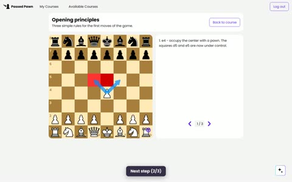</a> | **[Example](https://passed-pawn-dev.github.io/pp-documentation/#use_example)** · 0:31 | Stepping through the example |
| <a href="https://passed-pawn-dev.github.io/pp-documentation/#use_video">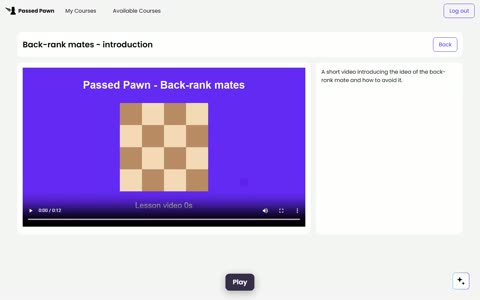</a> | **[Video](https://passed-pawn-dev.github.io/pp-documentation/#use_video)** · 0:28 | Watching a lesson video |
| <a href="https://passed-pawn-dev.github.io/pp-documentation/#buy_course">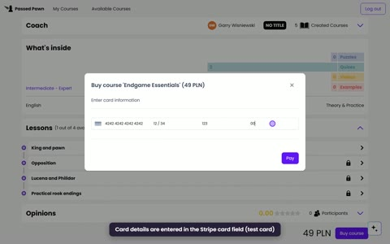</a> | **[Buying a course](https://passed-pawn-dev.github.io/pp-documentation/#buy_course)** · 0:54 | Paying for a course by card (Stripe) → access granted → lessons unlocked |

### Other — [`videos/other/`](videos/other)

| | Video | What it shows |
|---|---|---|
| <a href="https://passed-pawn-dev.github.io/pp-documentation/#ai_assistant">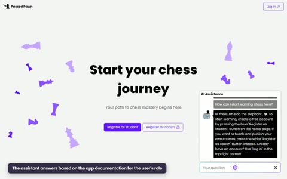</a> | **[AI assistant](https://passed-pawn-dev.github.io/pp-documentation/#ai_assistant)** · 1:01 | The chat assistant answering a visitor, a student and a coach, each based on the help for their role |

> Start with the two full flows (`e2e_coach`, `e2e_student`). The other videos each cover one
> type of lesson element: first how the coach creates it, then how the student uses it.
>
> In the recordings the payment and the AI assistant are simulated: no real Stripe transaction is made
> (the card field and the payment confirmation are mocked), and the assistant's answers are prepared
> in advance instead of being generated by the language model.
